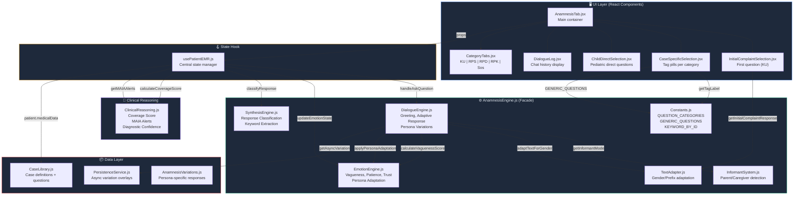
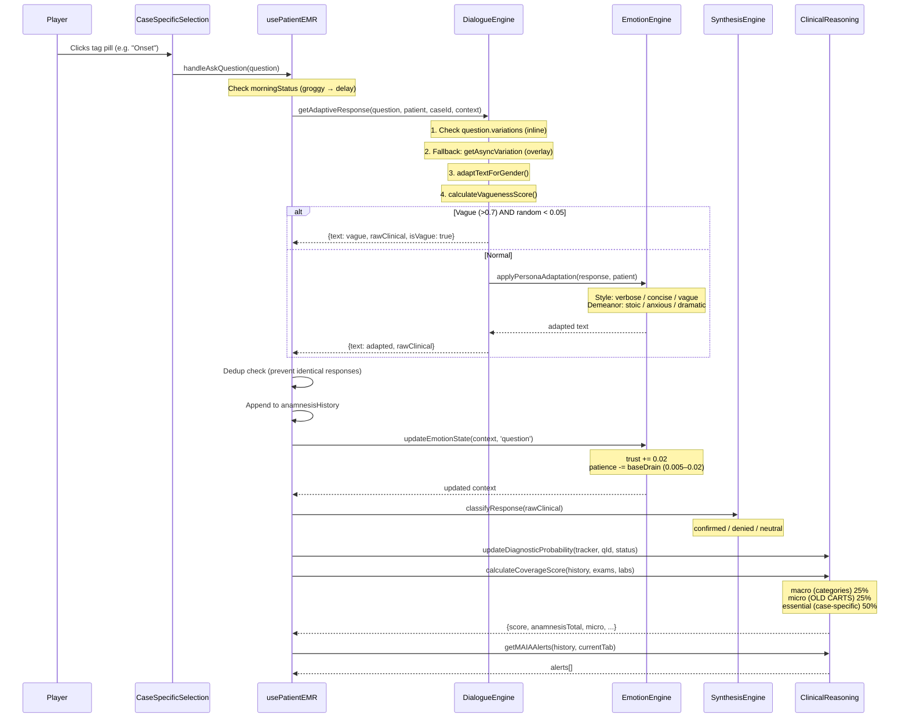

# PRIMER — Anamnesis System: Complete Architecture & Logic Reference
**Date**: 2026-02-24 | **Purpose**: Triangulation document for cross-LLM review

---

## 1. System Overview

The Anamnesis system in PRIMER simulates a doctor-patient interview at a Puskesmas (Indonesian primary care clinic). The player clicks question tags to ask the patient, and the system generates contextually-adapted responses based on the patient's persona, emotional state, and medical case data.



---

## 2. Data Flow: What Happens When a Player Clicks a Question Tag



---

## 3. Sub-Module Detail

### 3.1 Constants.js
| Export | Description |
|--------|------------|
| `QUESTION_CATEGORIES` | Map: 5 categories (KU, RPS, RPD, RPK, Sosial) |
| `ANAMNESIS_TIPS` | Per-category hint strings |
| `GENERIC_QUESTIONS` | Fallback questions per category when case has none |
| `KEYWORD_BY_ID` | Maps question IDs → short clinical keywords |
| `getTagLabel()` | Returns compact tag text for pill UI |
| `pickPersona()` | Selects persona from patient attributes |

### 3.2 InformantSystem.js
Determines if the patient answers directly or through an informant:
- **Pediatric** (age ≤ 7): parent/guardian answers, child can answer if age ≥ 4
- **Adolescent** (age 8–14): patient answers, parent present
- **Caregiver**: companion answers for confused/elderly (explicit `informant.required`)
- Returns `{ isInformant, reason, informantLabel, informantName, childCanAnswer }`

### 3.3 TextAdapter.js
| Function | Purpose |
|----------|---------|
| `getPrefix()` | Returns "Bapak", "Ibu", "Adik", "Mas", "Mbak", "Kakek", "Nenek" based on gender/age/informant |
| `adaptTextForGender()` | Replaces `{prefix}` and "Bapak/Ibu" tokens with correct form |
| `getDoctorAcknowledgment()` | Auto-response after initial complaint |
| `getInitialComplaintResponse()` | Generates the patient's first complaint text |
| `getSpeakerLabel()` | Returns who is speaking (patient, parent, etc.) |

### 3.4 DialogueEngine.js
| Function | Purpose |
|----------|---------|
| `generateGreeting()` | Time-aware doctor greeting + patient response |
| `getAsyncVariation()` | Loads persona overlays from PersistenceService |
| `getChildDirectQuestions()` | Pediatric-only direct questions (age 4–14) |
| `getAdaptiveResponse()` | **CORE**: Applies variations → gender → vagueness → persona |

**Variation Priority Chain:**
1. `question.variations.informant`
2. `question.variations.pediatric` (age < 12)
3. `question.variations.skeptical`
4. `question.variations.elderly` (age > 65)
5. `question.variations.low_education`
6. `question.variations.high_education`
7. Fallback: `getAsyncVariation()` overlay

### 3.5 EmotionEngine.js
| Function | Purpose |
|----------|---------|
| `calculateVaguenessScore()` | 0–1 score from keywords + length |
| `pickFromPool()` | Deterministic-ish pool picker per question |
| `applyPersonaAdaptation()` | Adds flavor based on `communicationStyle` + `demeanor` |
| `updateEmotionState()` | Tracks trust, patience, count per event |

**Persona Adaptation Matrix:**

| Style × Demeanor | Effect |
|---|---|
| `verbose` | Appends rambling suffix (if response < 100 chars) |
| `vague` | **10%** chance replaces with vague template (was 30%) |
| `anxious` | Appends worried suffix (skipped if vague-replaced) |
| `stoic` | Truncates to first sentence + (ekspresi datar) |
| `dramatic` | Wraps clinical text with mild dramatic flavor — **no ALL CAPS** |

**Patience Drain (per question):**

| Question Count | Drain/question |
|---|---|
| 1–12 | 0.005 |
| 13–20 | 0.01 |
| 21+ | 0.02 |

> [!NOTE]
> Patience bar UI has been **fully removed** from `AnamnesisTab.jsx`. The `patience` value still updates in `anamnesisContext` behind the scenes but has no visible effect.

### 3.6 SynthesisEngine.js
| Function | Purpose |
|----------|---------|
| `classifyResponse()` | Regex-based: confirmed / denied / neutral |
| `extractKeyword()` | Strips filler words → short clinical keyword |
| `truncateResponse()` | First sentence, max 55 chars |
| `synthesizeAnamnesis()` | Full structured checklist from history |

### 3.7 ClinicalReasoning.js
| Function | Purpose |
|----------|---------|
| `calculateCoverageScore()` | Composite score: Anamnesis (70%) + Physical (15%) + Labs (15%) |
| `getMAIAAlerts()` | Context-aware missing-category alerts |
| `getDiagnosticConfidence()` | **Decoupled**: relies on essential question coverage, NOT macro score |
| `updateDiagnosticProbability()` | Increments question/essential counters |
| `initDiagnosticTracker()` | Initializes tracking state |

**Coverage Score Formula:**

```
anamnesisScore = (macro × 0.25) + (micro × 0.25) + (essential × 0.50)
  macro    = sum of category weights where catCount > 0 (max 100)
  micro    = OLD CARTS dimensions covered / 7 (×100)
  essential = essentialIds hit / total (×100)

compositeScore = (anamnesisScore × 0.70) + (physical × 0.15) + (labs × 0.15)
```

**Diagnostic Confidence Formula (DECOUPLED):**

```
if essentialsTotal > 0:
  confidence = (essentialsCovered / essentialsTotal) × 100
else:
  confidence = min(totalQuestions / 5 × 60, 60)

bonus: +15 if physical > 40%, +20 if labs > 50%
```

> [!IMPORTANT]
> Previously, `getDiagnosticConfidence` used `coverage.score` as its base, which tightly coupled it to the macro coverage bar. This caused the Dx% indicator to mirror the Coverage% bar, making two UI elements show essentially the same number. Now they are **independent signals**.

---

## 4. Applied Fixes & Current Status

### 4.1 ✅ FIXED — Patience Bar Unwired (Fix 1)
- **Before**: Patience bar was commented out but still cluttering the JSX.
- **After**: Entire patience bar code block **deleted** from `AnamnesisTab.jsx`.
- Patience state still tracks internally in `anamnesisContext` for potential future use.

### 4.2 ✅ FIXED — Coverage Decoupled from Confidence (Fix 2)
- **Before**: `getDiagnosticConfidence()` used `coverage.score` as base → Dx% mirrored Coverage%.
- **After**: Dx% is driven by `essentialsCovered / essentialsTotal`, completely independent from the coverage bar.

### 4.3 ✅ FIXED — Dramatic ALL CAPS Removed (Fix 3)
- **Before**: `DRAMATIC_TEMPLATES` contained `'Aduh Dok!! '` and `'Dokter, tolong! '` with aggressive punctuation.
- **After**: Softened to `'Aduh Dok... '` and `'Aduh Dokter... '`.

### 4.4 ✅ FIXED — Vagueness Probability Reduced (Fix 4)
- **DialogueEngine** vagueness gate: `0.15` → `0.05`
- **EmotionEngine** vague style replacement: `0.30` → `0.10`
- Net effect: ~3× reduction in vague responses across all patients.

### 4.5 ✅ FIXED — Patience Drain Softened (Fix 5)
- **Before**: 0.015 / 0.025 / 0.04 per question at thresholds 12 / 20.
- **After**: 0.005 / 0.01 / 0.02 per question at same thresholds.
- A player can now ask ~50 questions before patience reaches 50% (was ~20).

---

## 5. Open Issues & Discussion Points (For Triangulation)

### 5.1 ⚠️ OPEN — Macro Score Only Counts `q.category`
The `macro` score counts questions by their `.category` field, which is injected as `anamnesisCategory` (the *currently selected tab*), **NOT** the question's inherent category. If a player asks an RPD question while on the RPS tab, it gets counted as RPS.

**Impact**: Macro score may miscount categories.
**Potential Fix**: Derive category from question ID prefix (`rpd_*`, `rpk_*`, etc.) or from `CaseLibrary` mapping.

### 5.2 ⚠️ OPEN — OLD CARTS Micro Score Too Strict
Micro score requires hitting specific IDs like `q_onset`, `rps_onset`. Case-specific questions with different IDs (e.g. `q_fever_onset`) don't match.

**Impact**: Micro score stays low even when relevant HPI questions are asked.
**Potential Fix**: Use keyword/regex matching on question text instead of exact ID matching.

### 5.3 ⚠️ OPEN — Essential Questions vs Generic Questions
`essentialQuestions` lists IDs that must be asked. If a case relies on `GENERIC_QUESTIONS`, essential IDs may not match generic IDs.

**Impact**: Essential progress can be 0% even if all relevant generics are asked.
**Potential Fix**: Map essential IDs to their generic equivalents.

### 5.4 💭 DISCUSSION — Should Patience Affect Gameplay?
Three approaches:
1. **Remove entirely** — patient always cooperates
2. **Keep as flavor** — changes text style, never blocks info (⬅ **current**)
3. **Make consequential** — patient can refuse to answer

### 5.5 💭 DISCUSSION — MAIA Alert Frequency
Alerts appear after 4+ questions if any category is unexplored. For simple cases (ISPA), forcing RPK/Sosial exploration feels pedantic.

**Options:**
1. Make MAIA case-aware (only suggest relevant categories)
2. Add a dismiss button
3. Increase threshold from 4 to 8 questions

### 5.6 💭 DISCUSSION — Encounter State Machine
An explicit state machine could formalize: `Greeting → Anamnesis → Physical → Labs → Diagnosis → Discharge`

**Trade-off**: More structure = more guided, less sandbox feel.

---

## 6. File Index

| File | Path | Role |
|------|------|------|
| AnamnesisEngine.js | `src/game/AnamnesisEngine.js` | Facade / re-export hub |
| Constants.js | `src/game/anamnesis/Constants.js` | Categories, generic Qs, keywords |
| InformantSystem.js | `src/game/anamnesis/InformantSystem.js` | Parent/caregiver detection |
| TextAdapter.js | `src/game/anamnesis/TextAdapter.js` | Gender/prefix text transforms |
| DialogueEngine.js | `src/game/anamnesis/DialogueEngine.js` | Response generation core |
| EmotionEngine.js | `src/game/anamnesis/EmotionEngine.js` | Persona, patience, vagueness |
| SynthesisEngine.js | `src/game/anamnesis/SynthesisEngine.js` | Response classification |
| ClinicalReasoning.js | `src/game/ClinicalReasoning.js` | MAIA, coverage, confidence |
| usePatientEMR.js | `src/hooks/usePatientEMR.js` | React state hook (orchestrator) |
| AnamnesisTab.jsx | `src/components/emr/AnamnesisTab.jsx` | Main UI container |
| CaseSpecificSelection.jsx | `src/components/emr/anamnesis/CaseSpecificSelection.jsx` | Tag pill grid |
| InitialComplaintSelection.jsx | `src/components/emr/anamnesis/InitialComplaintSelection.jsx` | Initial KU selection |
| ChildDirectSelection.jsx | `src/components/emr/anamnesis/ChildDirectSelection.jsx` | Pediatric direct Qs |
| DialogueLog.jsx | `src/components/emr/anamnesis/DialogueLog.jsx` | Chat history display |
| CategoryTabs.jsx | `src/components/emr/anamnesis/CategoryTabs.jsx` | Tab switcher |

---

*This document is intended for cross-LLM review. Please assess the architecture for correctness, identify additional design flaws, and suggest improvements to the open issues listed in Section 5.*
